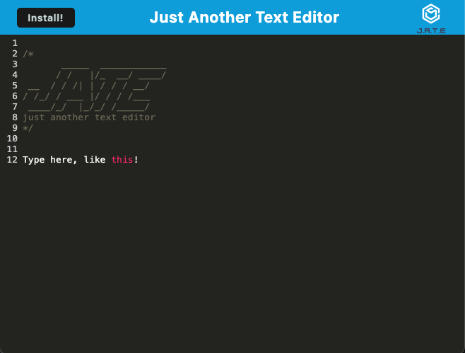

# Offline Text Editor

## Description

This is an example of a Progressive Web Application that uses multiple data persistence techniques that serve as redundancies in case one fails.

I created this project to prove my knowledge of javascript, webpack, as well as file structure and all the necessary connections.

It works by creating a bundled PWA when running "npm run build" from the root folder. The created PWA works by indexing all content the user types whenever the user focuses away, as well as relying on a service worker for added rigidity.

## Table of Contents

- [Installation](#installation)
- [Usage](#usage)
- [Contributing](#contributing)
- [License](#license)
- [Tests](#tests)
- [Questions](#questions)

## Installation

The user has 2 options for installation:

- For online only use: Simply visit https://offline-text-editor-yimx.onrender.com/
- For offline use: Visit https://offline-text-editor-yimx.onrender.com/ and click the install button in the top left and following the prompted steps to your liking.

## Usage

Use this project by following the installation steps listed above, and then typing anything you want into the numbered lines below the words "Just Anoter Text Editor." You may now click away to save that text and it will be there the next time you visit the site or load the downloaded application.

Use Case Example: You are opening multiple different tabs while trying to listen to your zoom instructor and need somewhere to keep notes that wont delete themselves when you accidently exit your browser.

## License

This project is licensed under the terms of the MIT license. See the badge at the top of the README for more details.

## Contributing

Additional Contributors: Starter code was given by UT Coding Bootcamp. Assistance in troubleshooting and completion was received from UT Coding Bootcamp tutors and James Ohlhausen (https://github.com/OhlhJames).

3rd Party Assets: CHATGPT

Tutorials: None

## Tests

- Type "Test Test Test" on line 15, and refresh the page. Your added text should still be present.

- Type "Test Test Test" on line 15, and exit chrome then reload the page. Your added text should still be present.

## Questions

Feel free to reach out to me with any additional questions through the following methods:

Github Profile: https://www.github.com/JesseDenier

Website: http://www.jessedenier.com
